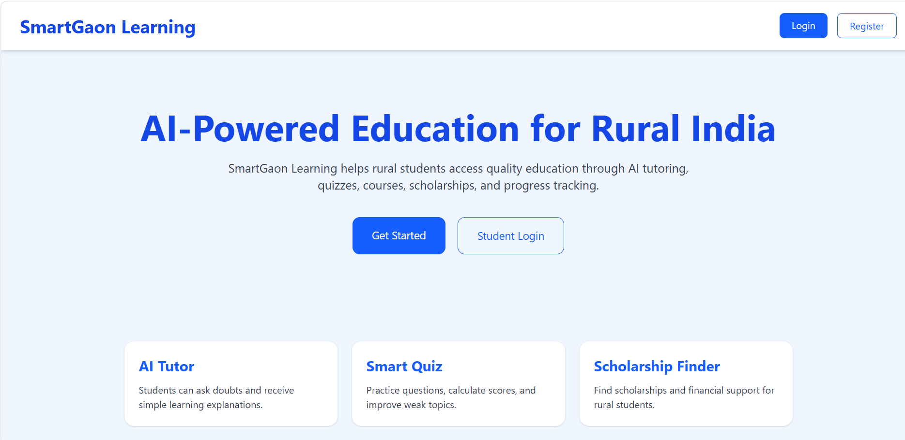
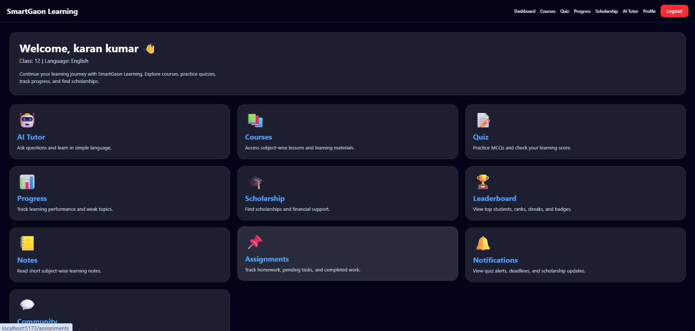
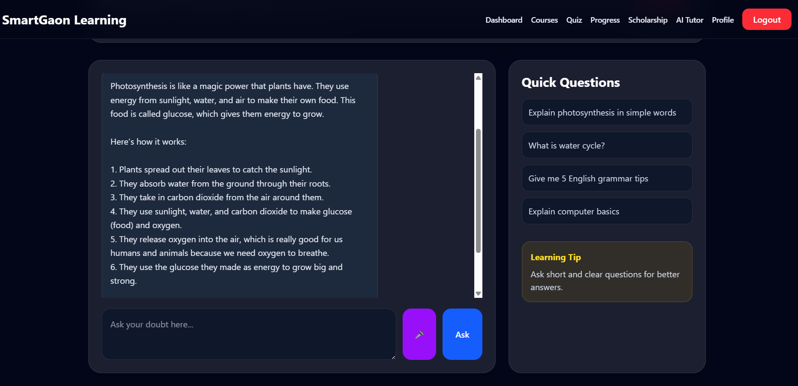
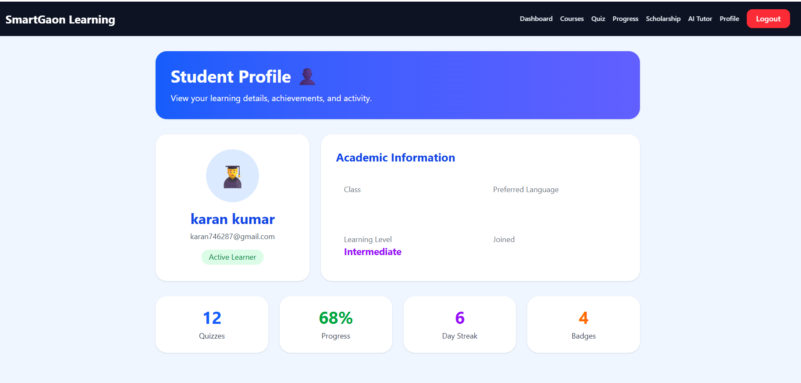
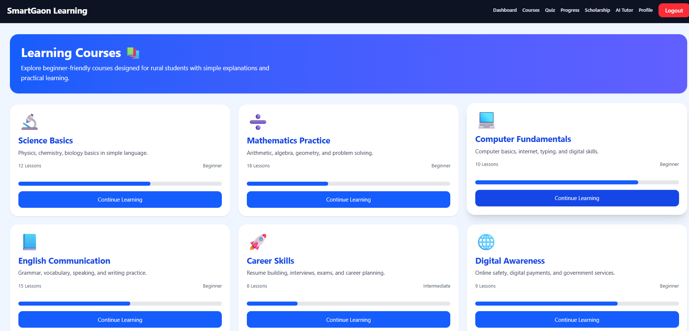

# SmartGaon Learning 🌾📚

SmartGaon Learning is a Full Stack AI-powered education platform designed for rural students.
The platform provides AI tutoring, quizzes, notes, leaderboards, and interactive learning features to make education more accessible and engaging.

## 🚀 Features

* 🔐 JWT Authentication
* 👨‍🎓 Student / Teacher / Admin Roles
* 🤖 AI Tutor using Groq AI
* 🧠 AI Quiz Generator
* 📊 Real-time Leaderboard
* 📒 Notes System
* 🎨 Premium UI with Tailwind CSS
* 🛡️ Protected Routes
* 💾 JSON Database Storage

---

## 🛠️ Tech Stack

### Frontend

* React.js
* Vite
* Tailwind CSS

### Backend

* Node.js
* Express.js

### AI Integration

* Groq API
* llama-3.3-70b-versatile

### Authentication

* JWT
* bcrypt

---

## 📂 Project Structure

smartgaon-learning
├── client
├── server

---

## ⚡ Installation

### Clone Repository

```bash
git clone https://github.com/karankumar-tech-eng/SmartGaon-Learning.git
```

### Frontend Setup

```bash
cd client
npm install
npm run dev
```

### Backend Setup

```bash
cd server
npm install
npm run dev
```
## 📸 Project Screenshots

### Home Page



### Dashboard



### AI Tutor



### Student Profile



### Learning Courses



---

## 🌟 Future Features

* AI Notes Generator
* Voice AI Tutor
* PDF Notes Upload
* Certificates
* Deployment

---

## 👨‍💻 Developer

Karan Kumar
B.Tech CSE (2022-2026)

---
